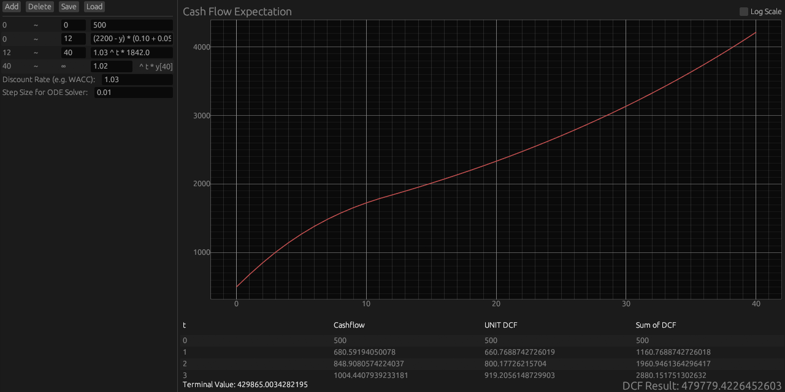

# dcf_simulator

A cross-platform (native + WebAssembly) **DCF (Discounted Cash-Flow) simulator** written in Rust with the `egui` GUI framework.  
It lets you define piece-wise cash-flow models — constants, time-functions or first-order ODEs — and instantly shows:

* the raw cash-flow series  
* unit-DCF values (cash-flow / discount factor)  
* running sum of discounted cash-flows  
* terminal value and total DCF result  

All results are plotted in real time and listed in a scrollable table.

---




## ✨ Features

| Category | Description |
|----------|-------------|
| Multi-model input | Per-period expression can be **constant**, **t-based function** or **ODE in y**. |
| Live visualization | Cash-flows rendered as a line plot (`egui_plot`) and tabulated (`egui_extras`), which also supports log-scale view. |
| Instant re-compute | Only when user input changes — keeps CPU usage low. |
| Native + WASM | Single code base; `cargo run --release` for desktop, `trunk serve` for browser. |
| Persistence | Save / load scenario to JSON via `rfd` (native) or `rfd::AsyncFileDialog` (web). |
| Short-cuts | `A` add row • `D` delete row • `S` save • `L` load. |

---

## 📐 Input Syntax

| Type | Example | Notes |
|------|---------|-------|
| Constant | `500` | Same cash-flow each step. |
| Time-dependent functions | `1.10 ^ t` | `t` is **period index** starting at 0. |
| ODE (first-order) | `(2200 - y) * (0.10 + 0.05 * y / 2200)` | `y` is previous cash-flow |

> ⚠️ **Only two symbols are recognised:** `t` and `y`.
> Any other variable name will make the segment evaluate to 0.

> ℹ️ **Note**  
> When you select an ODE model (`0.05 * y` etc.), the **initial value** is set to  
> the *last computed cash-flow value of the previous segment*.  
> This makes the ODE continue smoothly from the earlier series without requiring
> a separate initial-value input.

---

## 🚀 How to Run

### Native desktop

```bash
# prerequisites: Rust toolchain
git clone https://github.com/minzoong/dcf_simulator.git
cd dcf_simulator
cargo run --release
```

### WebAssembly (browser)

```bash
rustup target add wasm32-unknown-unknown
cargo install trunk
trunk serve # opens http://localhost:8080
```

A `<canvas id="egui_canvas">` is created automatically by Trunk.

---

## 📝 Usage

1. Left panel → `Add` to append a segment row.  
2. For each row fill **End** (last period of the segment) and **Expression**.  
3. Final infinite segment: type *growth factor* (e.g. `1.02`) → internally evaluated as an exponential growth curve (growth^t).
4. Set **Discount Rate** (e.g. `1.08`) and **ODE step size** if ODEs are present.  
5. Center panel shows plot, table, terminal value and total DCF.  
6. `Save` / `Load` buttons (or `S` / `L`) persist / restore the entire state.

---

## ⚠️ Caveats & Limits

* Periods must be strictly increasing; otherwise the graph disappears (invalid input).  
* Only one dot `.` is allowed in numeric fields; negative values are not yet supported.  
* ODE solver uses fixed tolerances `1e-10`; adjust in source if higher precision needed.  
* Mobile Safari blocks file API → save/load buttons are disabled on such browsers.
* The expression parser follows meval syntax; operator precedence matches standard math.

---

## License

MIT
